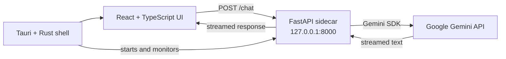

# Stealth Chat

A macOS desktop chat client that presents Google Gemini models in a familiar Messages-style interface.

Stealth Chat combines a React frontend, a Tauri desktop shell, and a local FastAPI sidecar. Prompts and conversation history are sent from the desktop app to the sidecar, which streams Gemini responses back into the selected conversation.

[Read the documentation](docs/DEVELOPMENT.md) · [Report a bug](https://github.com/MatthewA570/stealth-chat/issues/new) · [Request a feature](https://github.com/MatthewA570/stealth-chat/issues/new)

> [!NOTE]
> Stealth Chat is an experimental macOS project, not an iMessage client. The sample SMS conversations are read-only UI fixtures, and the app does not connect to Messages, iCloud, or your contacts.

## Contents

- [About the project](#about-the-project)
- [Built with](#built-with)
- [Getting started](#getting-started)
  - [Requirements](#requirements)
  - [Installation](#installation)
- [Usage](#usage)
- [Building the app](#building-the-app)
- [Architecture](#architecture)
- [Project layout](#project-layout)
- [Project status](#project-status)
- [Contributing](#contributing)
- [License and trademarks](#license-and-trademarks)
- [Maintainer](#maintainer)
- [Acknowledgments](#acknowledgments)

## About the project

Stealth Chat explores what an AI desktop client can feel like when model selection is presented as choosing a conversation instead of configuring a traditional chatbot. Each Gemini model appears as a separate contact, while streaming replies use the visual language of macOS Messages.

The desktop app is self-contained after packaging: Tauri starts the frozen Python sidecar alongside the interface, and users provide their own Gemini API key at runtime.

### What it includes

- A macOS-native window with a transparent title bar and sidebar vibrancy
- A responsive Messages-inspired conversation layout with search and collapsible navigation
- Streaming responses from Gemini 3.5 Flash, Gemini 3.1 Pro, and Gemini 3.5 Flash-Lite
- Per-model chat histories for the current app session
- A packaged Python sidecar, so release builds do not require a separate Python installation
- A local API-key flow with no credentials committed to the repository

## Built with

- [Tauri 2](https://v2.tauri.app/) and Rust for the native desktop shell
- [React 19](https://react.dev/) and TypeScript for the interface
- [Vite](https://vite.dev/) and [Tailwind CSS](https://tailwindcss.com/) for frontend development and styling
- [FastAPI](https://fastapi.tiangolo.com/) and Uvicorn for the loopback service
- [Google Gen AI SDK](https://googleapis.github.io/python-genai/) for Gemini requests
- [PyInstaller](https://pyinstaller.org/) for the packaged Python sidecar

## Getting started

### Requirements

Development currently targets macOS. You will need:

- macOS 10.15 or later
- Xcode Command Line Tools (`xcode-select --install`)
- Rust 1.77.2 or later
- Node.js 20.19 or later (the current LTS release is recommended)
- Python 3.10 or later
- A [Google AI Studio API key](https://aistudio.google.com/)

The sidecar must be built for the same architecture as the Tauri app. The examples below use Apple silicon; Intel Macs use the `x86_64-apple-darwin` target triple.

### Installation

Clone the repository and install the JavaScript dependencies:

```bash
git clone https://github.com/MatthewA570/stealth-chat.git
cd stealth-chat
npm ci
npm ci --prefix client
```

Create the Python environment and build the sidecar:

```bash
cd server
python3 -m venv venv
source venv/bin/activate
python -m pip install fastapi uvicorn google-genai pydantic pyinstaller
pyinstaller --clean --onefile --name server main.py
cd ..

mkdir -p src-tauri/binaries
cp server/dist/server "src-tauri/binaries/server-$(rustc -vV | sed -n 's|host: ||p')"
```

Start the desktop app from the repository root:

```bash
npm run dev
```

When you send your first prompt, Stealth Chat opens the API configuration dialog. Paste your Google AI Studio key and save it; the selected Gemini conversation is then ready to use.

For frontend-only work, run `npm run dev --prefix client`. The interface will open in a browser, but live responses still require the sidecar on `127.0.0.1:8000`.

## Usage

1. Select one of the Gemini conversations in the sidebar.
2. Enter a prompt in the composer and press the send button.
3. Add your Google AI Studio API key when prompted.
4. Continue the conversation while the app supplies the existing thread as context.

Gemini conversations are interactive. The sample contact conversations demonstrate the interface and cannot send messages. Search filters conversations by name, and the sidebar can be hidden to give the active thread more room.

The API key persists locally between launches. Conversation history does not; closing the app resets every thread to its sample state.

## Building the app

Build a release bundle after placing the correctly named sidecar in `src-tauri/binaries`:

```bash
npm run build
```

Tauri writes the generated application and disk image under `src-tauri/target/release/bundle/`. PyInstaller produces architecture-specific binaries, so build the sidecar on each architecture you intend to distribute.

Unsigned local builds may trigger a macOS Gatekeeper warning. Public distribution also requires the usual Apple code-signing and notarization steps, which are not configured in this repository.

## Architecture



The app stores the API key in the WebView's `localStorage`. Each request passes it to the loopback sidecar in the `X-Gemini-API-Key` header, and the sidecar uses it to call Google. The backend is stateless and binds only to `127.0.0.1`.

`localStorage` is convenient for local development, but it is not an operating-system credential vault. Treat the key as a secret, restrict it to the Gemini API, and remove or rotate it before sharing your user profile or machine. A production release should move credential storage to the macOS Keychain or another secure secret store.

## Project layout

```text
.
├── client/                 React, TypeScript, Vite, and Tailwind frontend
├── server/                 FastAPI streaming sidecar
├── src-tauri/              Tauri configuration and Rust desktop shell
├── docs/                   Architecture and development notes
└── package.json            Root Tauri commands
```

More detail is available in the [architecture](docs/ARCHITECTURE.md) and [development guide](docs/DEVELOPMENT.md).

## Project status

Stealth Chat is an early-stage personal project. The core desktop shell, Gemini request flow, streamed rendering, model switching, conversation search, and macOS styling are implemented.

### Current limitations

- macOS is the only tested and visually supported platform.
- Conversations are kept in memory and reset when the app restarts.
- Only the three Gemini conversations accept prompts; the contact threads are read-only examples.
- Attachments, audio, emoji selection, compose, and conversation-detail controls are visual placeholders.
- API errors are returned as chat text, and automated test coverage has not been added yet.

Potential next steps include persistent conversations, Keychain-backed credential storage, functional composer controls, automated tests, and signed release builds. These are directions rather than committed release dates; current work is tracked in [GitHub Issues](https://github.com/MatthewA570/stealth-chat/issues).

## Contributing

Issues and focused pull requests are welcome. Read [CONTRIBUTING.md](CONTRIBUTING.md) for the local checks, project conventions, and pull-request expectations.

## License and trademarks

This repository does not currently include a software license. Unless a license is added, the source is available for viewing but is not granted for reuse, modification, or redistribution.

Stealth Chat is an independent project. It is not affiliated with or endorsed by Apple or Google. iMessage, Messages, macOS, Gemini, and related marks belong to their respective owners.

## Maintainer

Maintained by [Matthew Ayala](https://github.com/MatthewA570). Project questions and bug reports are best submitted through [GitHub Issues](https://github.com/MatthewA570/stealth-chat/issues).

## Acknowledgments

- README structure informed by the [Best README Template](https://github.com/othneildrew/Best-README-Template)
- Interface inspiration from Apple's Messages app and macOS design language
- Sample contact-photo credits are recorded in [`client/public/contact-photos/ATTRIBUTION.md`](client/public/contact-photos/ATTRIBUTION.md)
